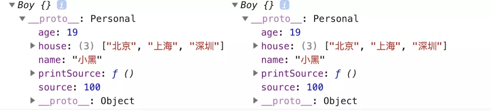

【2019.10.13】部分整理自[【js的继承方法小结（prototype、call、apply）（推荐）】](https://www.jb51.net/article/159902.htm)

---

## js 的继承方法小结( `prototype` 、`call` 、`apply` )

### js 的原型继承 `prototype`

什么是 `prorotype` ？

> js 中，有 `一切皆对象` 的说法

能 `new` 出来的都是函数对象，否则就是普通对象

- 函数对象都有 prototype 原型对象

  - 函数对象的一个特点：可以实现不同类之间的方法继承

  - 函数的子类可以共享父类的方法，而父类不能用子类的方法

- 普通对象则只有 `__proto__` 原型指针

```js
// 创建父类函数对象，并添加父类的私有属性
function Personal(name, age) {
  this.name = name;
  this.age = age;
  this.house = ['北京', '上海'];
}

// 给父类原型动态添加方法
Personal.prototype.run = function() {
  console.log('原型方法：' + this.name + ' is running!');
}

// new 一个子类
var per = new Personal('小白', 24);

per.run();
//输出结果 原型方法：小白 is running!

// 创建子类函数对象
function Boy() {};

// 子类继承父类的所有属性和方法
Boy.prototype = new Personal('小黑', 19);

// 给子类添加原型属性
Boy.prototype.source = 100;

// 给子类添加方法
Boy.prototype.printSource = function() {
  console.log(this.name + ' 的原型方法 printSouce 打印成绩为：' + this.source)
}

Boy.prototype.run();
// 输出结果 原型方法：小黑 is running!

var boys = new Boy();

boys.printSource();
// 输出结果 小黑 的原型方法 printSouce 打印成绩为：100
// 触发 Boy.prototype.printSource 函数中的执行结果

console.log(boys);
// 输出结果 Boy {}
// 但其原型 __proto__ 中有不少数据内容，可自行了解
```

打印结果：

```
原型方法：小白 is running!
原型方法：小黑 is running!
小黑 的原型方法 printSouce 打印成绩为：100
Boy {}
```

以下是关于 prototype 继承需要注意的点：

- 如果父类中有引用类型的属性：Array 、Object 等，子类继承了这些属性，并尝试改变的话，会影响到父类的属性

  ```js
  //创建另外一个实例1：
  var boys1 = new Boy();
  boys1.house.push('深圳');
  //打印这两个实例：
  console.log(boys, boys1);
  ```

  

  - 可以看出来，当属性为引用类型时，只要有一个实例的属性做了操作，所有的实例都会受到影响

- 该方式导致 `Boy.prototype.constructor` 被重写，它指向的是 `Personal` 而非 `Boy`

  - 因此你需要手动将 `Boy.prototype.constructor` 指回 `Boy`

  ```js
  Boy.prototype = new Personal();

  Boy.prototype.constructor === Personal;
  // true
  
  // 重写 Boy.prototype 中的 constructor 属性，指向自己的构造函数 Boy
  Boy.prototype.constructor = Boy;
  ```

- 因为 `Boy.prototype = new Personal()` 重写了 `Boy` 的原型对象，所以 `printSource` 放在重写原型对象之前会被覆盖掉，因此给子类添加原型方法必须在替换原型之后

  ```js
  function Boy() {}
  Boy.prototype = new Personal();
  
  // 给子类添加原型方法必须在替换原型之后
  Boy.prototype.printSource = function() {
  console.log('printSource~');
  };
  ```

- 创建 `boys` 实例时无法向父类的构造函数传参，也就是无法初始化 `source` 属性，因此，也只能创建实例之后再修改父类的属性

```js
const boys = new Boy();
 
// 只能创建实例之后再修改父类的属性
boys.source = 100;
```

## `apply()` 、`call()` 方法的继承

用法：

```
obj.call(thisObj, arg1, arg2, ...);
obj.apply(thisObj, [arg1, arg2, ...]);
```

- obj 是父级，thisObj 是子级；第二个参数 apply 可以接收一个数组，而 call 只能是每项逐个接收

- apply 和 call 本来就是为了扩展函数的作用域而生的，换句话说就是为了改变 this 的指向存在的

- 当一个 object 没有某种方法，但是其他的有，我们可以借助 call 和 apply 来用其他对象的方法来做操作，也可以传参数

```js
function Personal(name, sex) {
  this.name = name;
  this.sex = sex;
  this.say = function (){
  alert('姓名：' + this.name + ';性别：' + this.sex)
  }
}
const per = new Personal('Allan', '男')
per.say();
  
//apply()方法实现：
function Girls(name, sex) {
  Personal.apply(this, [name, sex]);
  //Person.apply(this,arguments); //跟上句一样的效果，arguments 
  //Print.apply(this,arguments); //还可以实现继承多个父类，但是原型 prototype只能继承一个父类！！！切记
}
const girls1 = new Girls('Lucy', '女')
girls1.say();
  
//call()实现：
function Boy(name, sex) {
  Personal.call(this, name, sex);
}
const boys = new Boy('Barry', '男');
boys.say()
```

### [【更多内容可参考：菜鸟教程 JavaScript 中 call()、apply()、bind() 的用法】](https://www.runoob.com/w3cnote/js-call-apply-bind.html)
